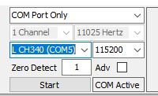
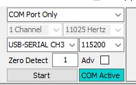

Адаптер имеет два входа:

  - Аудиоразъем 3.5 для датчика Холла. Датчик Холла должен располагаться рядом с магнитом на оси ролика. Датчик чувствителен к полярности магнитного поля, поэтому, если вы не получаете сигнал оборотов ролика, попробуйте повернуть магнит (или датчик) на 180 градусов. для увеличения длины проводa можно использовать aудиоудлинитель. в моих тестах адаптер работал с 2-метровым удлинителем.
  - Простой разъем электрического блока для провода датчика оборотов. Здесь можно использовать любой провод, проверено на 3-метровом проводе. Этот провод должен проходить рядом с проводом свечи зажигания. Конец провода лучше заизолировать, чтобы высокое напряжение от искры не попало в адаптер

Скачать https://github.com/rverzinkevicius/ESP8266SimpleDyno/raw/main/SimpleDyno.6.5.3.rar

Подключи адаптер к компьютеру.

Распакуй Скачаный архив, открой папку и запусти SimpleDyno.exe

Настрой параметри адаптера. Выбери Com-порт с именем CH340.

Нажми «Start», и увидешь, что «COM Active» мигает.

Проверь, изменяется ли RPM1 (обороты ролика) при вращении ролика вручную.

Запусти скутер и провер, правильно ли отображается RPM2 (обороты двигателя).

Нажми «Power run» и выбери место для сохранения файла.

Разгони скутер до максимальных оборотов. Лучше всего заблокировать вариатор, сняв все ролики и добавив втулку за переднюю пластину вариатора, чтобы вариатор находился в максимальном положении.

Программное обеспечение должно открыть новое окно с приблизительным графиком, где вам нужно будет выбрать лучший алгоритм (выпадающий список вверху слева), чтобы две линии совпадали больше всего.

Сними флажок слева с чем-то вроде «Add to existing data».

Нажми «go to analysis»

Ось X: RPM2 (выбери единицы оборотов RPM) 

Ось Y1: Roller Torque 

Ось Y2: Power (выбери единицы Hp)

Ось Y3: Speed (выбери единицы км/ч)

Ось Y4: None

Корр. Скорость (Corr. Speed): км/ч

Если ты выполняешь измерения без блокировки вариатора, для оси X используй RPM1 или Speed.
