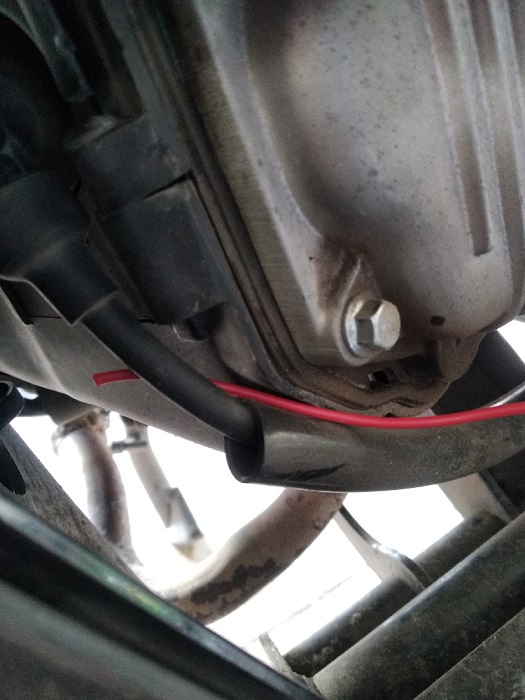
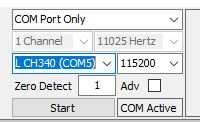
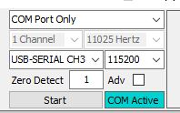

Adapter has two inputs: 

 - 3.5 audio jack for Hall sensor. Hall sensor should be placed near magnet on roller axle. Sensor is sensitive to magnetic field polarity, so if you do not get roller RPM signal, try rotating senor 180 dgrees. Audio extension cable can be used to extend length if required, in my tests it worked with 2m long extension.
 - Simple electrical block connector for RPM pickup wire. Any wire can be used here, tested with 3m long wire. This wire should go near spark plug wire. Better to insulate end of wire, so high voltage from spark doesn't go into adapter

Download https://github.com/rverzinkevicius/ESP8266SimpleDyno/raw/main/SimpleDyno.6.5.3.rar

Connect adapter to computer.

Extract, open folder and launch SimpleDyno.exe

Setup connection to adapter settings. Select Com port which has CH340 in name.

Click Start and you should see "COM Active" blinking

